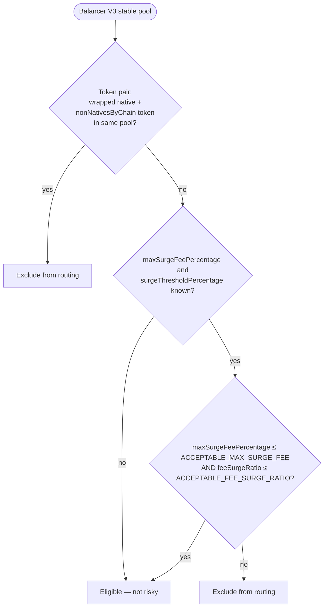

# KyberSwap — Risky Surge Policy (`isRisky`)

Below we describe how the KyberSwap liquidity tracker decides whether a **Balancer V3 stable** pool is excluded from routing under the risky surge policy. 

A pool marked risky is **skipped for aggregation quotes**, note - it is not necessarily surging at that moment.

---

## Decision flow



**Order matters.** Token composition is checked before surge parameters. Conservative surge settings never rescue a pool that already matches the token-pair rule.

---

## Two checks (in order)

### 1. Token pair — always risky

If the pool holds **both**:

- the chain’s **wrapped native** (e.g. WETH on Ethereum), and  
- at least one address in **`nonNativesByChain`** for that chain (e.g. USDC, USDT on mainnet; see `constant.go`),

→ **`isRisky` = true**. Surge hook and surge fee settings are ignored.

Typical case: WETH + USDC stable pool, including pools **without** a Stable Surge hook.

### 2. Surge parameters — only if Path 1 did not match

If `maxSurgeFeePercentage` or `surgeThresholdPercentage` is missing (no Stable Surge hook) → **`isRisky` = false**.

Otherwise, from the hook’s `maxSurgeFeePercentage` and `surgeThresholdPercentage`:

```
feeSurgeRatio = maxSurgeFeePercentage / (1 - surgeThresholdPercentage)
                // 0 if surgeThresholdPercentage ≥ 1

if maxSurgeFeePercentage ≤ ACCEPTABLE_MAX_SURGE_FEE
   AND feeSurgeRatio ≤ ACCEPTABLE_FEE_SURGE_RATIO:
    isRisky = false
else:
    isRisky = true
```

(`ACCEPTABLE_MAX_SURGE_FEE` and `ACCEPTABLE_FEE_SURGE_RATIO` are both **0.1** in tracker/API scale.)

---

## Examples

| Composition | maxSurgeFeePercentage / surgeThresholdPercentage | `isRisky` | Why |
|-------------|-----------------------------------------------------|-----------|-----|
| WETH + USDC | Any / no hook | Yes | Path 1 — token pair |
| WETH + USDC | 0.05 / 0.3 | Yes | Path 1 wins before surge is considered |
| RLUSD + USDC, no WETH | 0.95 / 0.3 | Yes | Fails surge check |
| RLUSD + USDC, no WETH | 0.05 / 0.3 | No | Passes surge check |
| Two tokens not in allowlist, no WETH | 0.95 / 0.3 | Yes | Fails surge check |

---

## Audit

TypeScript script in this folder that applies the policy above to **live Balancer V3 stable pools** (via the v3 API), scoped to pools with **TVL > $10k** (`minTvl` on `poolGetPools`). It evaluates each pool with the same `isRisky` logic, writes [output.json](./output.json), and prints a console summary of risky pools (`surge_excluded: true`).

For chains queried, output fields, allowlists, and test vectors, see [SPEC.md](./SPEC.md).

**Run** (from repo root; requires network):

```bash
npx ts-node balancer/api/stableSurgeRisky/audit.ts
```

### Results snapshot

The figures below match [output.json](./output.json) from a recent run (49 pools evaluated, TVL > $10k, 9 active chains).

| | Count |
|--|------:|
| Evaluated | 49 |
| Risky (`surge_excluded`) | 20 |
| Not risky | 29 |

All 20 risky pools failed the **surge parameter** check (`exclusion_path: aggressive_surge`). None matched the **token pair** rule in this snapshot (no WETH + USDC/USDT-style pairs above the TVL floor, or they are not in the fetched set).

**By chain** — chains with zero risky pools in this run: Gnosis, Optimism, Plasma.

| Chain | Risky pools |
|-------|------------:|
| Mainnet | 8 |
| Monad | 4 |
| Base | 3 |
| HyperEVM | 2 |
| Avalanche | 2 |
| Arbitrum | 1 |

| Failure mode | Pools | What to change |
|--------------|------:|----------------|
| `feeSurgeRatio` > 0.1 only (`maxSurgeFeePercentage` ≤ 0.1) | 17 | Usually lower `surgeThresholdPercentage` and/or `maxSurgeFeePercentage` so ratio ≤ 0.1 |
| `maxSurgeFeePercentage` = 0.95 | 3 | Lower max (Mainnet ×2, Arbitrum ×1) |

Common pattern among the 17: `surgeThresholdPercentage` of **0.4–0.8** with moderate `maxSurgeFeePercentage` (e.g. 0.05–0.09), pushing `feeSurgeRatio` above 0.1.

#### Risky pools (action list)

All pools use the `STABLE_SURGE` hook and failed the surge-parameter check. Sorted by chain, then TVL (high to low). Pool addresses link to the Balancer UI.

**Failure mode** is which cap failed: `maxSurgeFeePercentage` (> 0.1), or `feeSurgeRatio` only (max ≤ 0.1 but ratio > 0.1).

##### MAINNET

| Pool | Failure mode | Owner | TVL ($) | maxSurgeFeePercentage | surgeThresholdPercentage | feeSurgeRatio |
|------|--------------|-------|--------:|----------------------:|-------------------------:|--------------:|
| [0xae25…83bd](https://balancer.fi/pools/ethereum/v3/0xae255db04ba78519f33871c557d8fd6bafdb83bd) | `feeSurgeRatio` | zero address | 27,991,458 | 0.09 | 0.6 | 0.225 |
| [0x6b31…d883](https://balancer.fi/pools/ethereum/v3/0x6b31a94029fd7840d780191b6d63fa0d269bd883) | `feeSurgeRatio` | zero address | 6,741,887 | 0.05 | 0.6 | 0.125 |
| [0xc334…557e](https://balancer.fi/pools/ethereum/v3/0xc334299aef610fc79da129a920317b2bdbe2557e) | `feeSurgeRatio` | zero address | 119,871 | 0.09 | 0.5 | 0.18 |
| [0xe00e…dbd3](https://balancer.fi/pools/ethereum/v3/0xe00e947decfe01692070e113002705bdf77ddbd3) | `feeSurgeRatio` | zero address | 85,216 | 0.09 | 0.8 | 0.45 |
| [0x368b…ba5a](https://balancer.fi/pools/ethereum/v3/0x368bd7879d5f494d71959ae1c50b54809e6bba5a) | `maxSurgeFeePercentage` | [0x2ea9…0d04](https://etherscan.io/address/0x2ea96fea485008a5123027a553b3f87a710d0d04) | 40,351 | 0.95 | 0.3 | 1.357 |
| [0xbb6f…6bbc](https://balancer.fi/pools/ethereum/v3/0xbb6f701f42a6104deffc041c5c0057b8a9c46bbc) | `feeSurgeRatio` | zero address | 34,738 | 0.09 | 0.4 | 0.15 |
| [0xfee0…c73b](https://balancer.fi/pools/ethereum/v3/0xfee0490b9f70163648bc8dbaaf3dfffc8420c73b) | `maxSurgeFeePercentage` | [0x2ea9…0d04](https://etherscan.io/address/0x2ea96fea485008a5123027a553b3f87a710d0d04) | 30,212 | 0.95 | 0.3 | 1.357 |
| [0x6c59…59ed](https://balancer.fi/pools/ethereum/v3/0x6c5972311191097d002e804a9bf97c96c54059ed) | `feeSurgeRatio` | zero address | 11,868 | 0.1 | 0.6 | 0.25 |

##### MONAD

| Pool | Failure mode | Owner | TVL ($) | maxSurgeFeePercentage | surgeThresholdPercentage | feeSurgeRatio |
|------|--------------|-------|--------:|----------------------:|-------------------------:|--------------:|
| [0xc71c…7b08](https://balancer.fi/pools/monad/v3/0xc71c30914bc7790218b1adee782ba307b7867b08) | `feeSurgeRatio` | zero address | 630,783 | 0.09 | 0.4 | 0.15 |
| [0x340f…06cb](https://balancer.fi/pools/monad/v3/0x340fa62ae58e90473da64b0af622cdd6113106cb) | `feeSurgeRatio` | zero address | 143,828 | 0.09 | 0.4 | 0.15 |
| [0x02b3…e7f8](https://balancer.fi/pools/monad/v3/0x02b34a02db24179ac2d77ae20aa6215c7153e7f8) | `feeSurgeRatio` | zero address | 134,099 | 0.09 | 0.4 | 0.15 |
| [0xc0ab…e045](https://balancer.fi/pools/monad/v3/0xc0abfaa62331db4bee1d3904b86310c5d120e045) | `feeSurgeRatio` | zero address | 125,347 | 0.09 | 0.4 | 0.15 |

##### HYPEREVM

| Pool | Failure mode | Owner | TVL ($) | maxSurgeFeePercentage | surgeThresholdPercentage | feeSurgeRatio |
|------|--------------|-------|--------:|----------------------:|-------------------------:|--------------:|
| [0x0915…582a](https://balancer.fi/pools/hyperevm/v3/0x0915824c3c5239928253548cd998a5f19668582a) | `feeSurgeRatio` | zero address | 64,851 | 0.09 | 0.6 | 0.225 |
| [0xba01…d4bd](https://balancer.fi/pools/hyperevm/v3/0xba0163e18b8b6236d5046841e698f2f2d89bd4bd) | `feeSurgeRatio` | zero address | 11,297 | 0.07 | 0.6 | 0.175 |

##### BASE

| Pool | Failure mode | Owner | TVL ($) | maxSurgeFeePercentage | surgeThresholdPercentage | feeSurgeRatio |
|------|--------------|-------|--------:|----------------------:|-------------------------:|--------------:|
| [0xe555…2141](https://balancer.fi/pools/base/v3/0xe5556b41256d7efb2f0a17011ef8ab507a352141) | `feeSurgeRatio` | [0x93e5…5927](https://basescan.org/address/0x93e5260ac975b475af8bf818c14deee7fefd5927) | 152,622 | 0.09 | 0.3 | 0.129 |
| [0x3bcf…bc2c](https://balancer.fi/pools/base/v3/0x3bcf4e84c32d90bb309eab58d97b70372c84bc2c) | `feeSurgeRatio` | zero address | 150,858 | 0.1 | 0.3 | 0.143 |
| [0x2be9…2cba](https://balancer.fi/pools/base/v3/0x2be9d6899432e988a8b71eb80ee29a49521e2cba) | `feeSurgeRatio` | [0x8ab0…b29a](https://basescan.org/address/0x8ab0eb1314ffa9636b941e0d1c5805dec905b29a) | 62,409 | 0.09 | 0.4 | 0.15 |

##### ARBITRUM

| Pool | Failure mode | Owner | TVL ($) | maxSurgeFeePercentage | surgeThresholdPercentage | feeSurgeRatio |
|------|--------------|-------|--------:|----------------------:|-------------------------:|--------------:|
| [0x412d…3fc6](https://balancer.fi/pools/arbitrum/v3/0x412d928c31b82b78ccb8b04aa8bfcdadb9236fc6) | `maxSurgeFeePercentage` | [0x8ab0…b29a](https://arbiscan.io/address/0x8ab0eb1314ffa9636b941e0d1c5805dec905b29a) | 64,531 | 0.95 | 0.4 | 1.583 |

##### AVALANCHE

| Pool | Failure mode | Owner | TVL ($) | maxSurgeFeePercentage | surgeThresholdPercentage | feeSurgeRatio |
|------|--------------|-------|--------:|----------------------:|-------------------------:|--------------:|
| [0x1fed…8dca](https://balancer.fi/pools/avalanche/v3/0x1fed8401c145f64da567881d272d0df233118dca) | `feeSurgeRatio` | zero address | 573,090 | 0.05 | 0.6 | 0.125 |
| [0x832f…d1f0](https://balancer.fi/pools/avalanche/v3/0x832f8e068e92d56b94205ea605e5cdaa7cded1f0) | `feeSurgeRatio` | [0x8ab0…b29a](https://snowscan.xyz/address/0x8ab0eb1314ffa9636b941e0d1c5805dec905b29a) | 12,197 | 0.09 | 0.3 | 0.129 |

---

