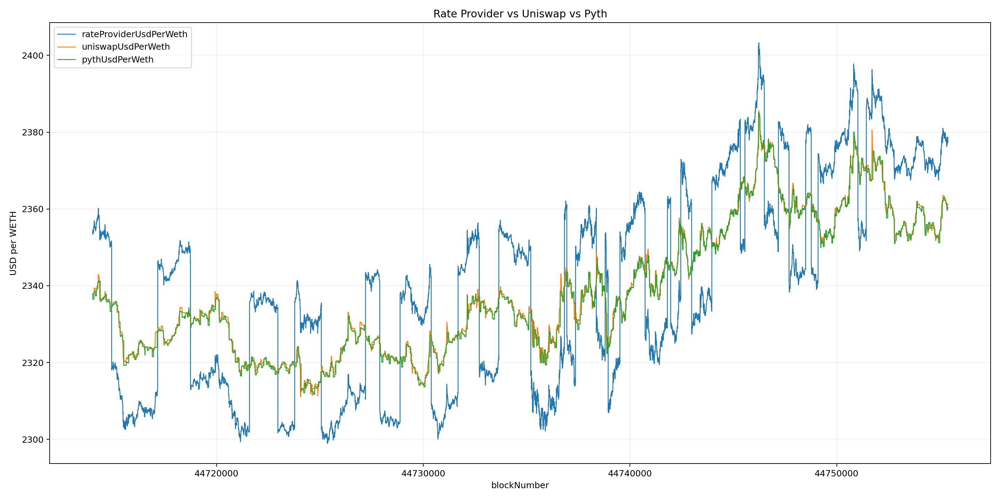
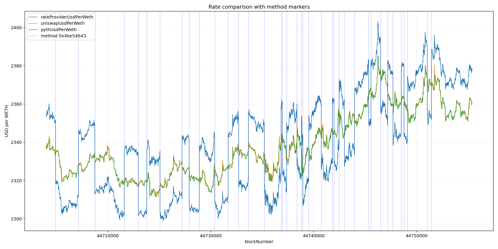
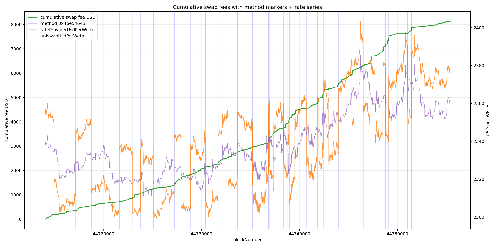

# Pool Study 1

## Pool Details

```graphql
{
"chain": "BASE",
"poolAddress": "0x10bdbb4fe8dfd348d44397eedabb737df68bc9a0",
"poolId": "0x10bdbb4fe8dfd348d44397eedabb737df68bc9a0000200000000000000000248",
"type": "GYROE"
"protocolVersion": 2,
"dynamicData": {
    "lifetimeSwapFees": "8137.01",
    "lifetimeVolume": "1849321.48",
    "totalLiquidityAth": "0",
    "totalLiquidity": "0.00",
    "totalLiquidityAthTimestamp": 0
},
"balancerUrl": "https://balancer.fi/pools/base/v2/0x10bdbb4fe8dfd348d44397eedabb737df68bc9a0000200000000000000000248"
}
```

Note the pool life time swap fees which are the most for any pool created by EOA of interest (EOI): `0x91906be1391d2fc7d01a7a6757c69daaefd2c257`.

Pool created at block: 44713999. EOA exited at block: 44755378
(https://basescan.org/tx/0x2ab83b7c31810138788d11d4be5adacbe7e9e00e78ab9b73f556d1ad0fa87ce3)

## Profitability

To quantify economic outcome directly for this pool lifecycle, a single-LP profit study was run for the known one-time join and one-time exit:
  * Join tx: [`0xe93dc163fe50bf7d0c89c0fbe53c448150f3b4849d21abc0f8445faa61c10848`](https://basescan.org/tx/0xe93dc163fe50bf7d0c89c0fbe53c448150f3b4849d21abc0f8445faa61c10848) (block `44714002`)
  * Exit tx: [`0x2ab83b7c31810138788d11d4be5adacbe7e9e00e78ab9b73f556d1ad0fa87ce3`](https://basescan.org/tx/0x2ab83b7c31810138788d11d4be5adacbe7e9e00e78ab9b73f556d1ad0fa87ce3) (block `44755378`)

The study values both legs in USD using Uniswap v3 WETH/USDC with a spot+TWAP guard (10-minute TWAP, 150 bps threshold), assumes USDC = 1.00 USD, and excludes gas.
Implementation and outputs are available in [profitStudy](./data/profitStudy/):
  * [runProfitStudy.ts](./data/profitStudy/runProfitStudy.ts)
  * [profitStudy.result.json](./data/profitStudy/profitStudy.result.json)
  * [profitStudy.md](./data/profitStudy/profitStudy.md)

Key outputs from this window:
  * Join value: `53,862.62` USD
  * Exit value: `58,205.00` USD
  * Realized LP PnL: `+4,342.37` USD (`+8.06%`)
  * HODL benchmark at exit: `53,915.52` USD
  * LP minus HODL: `+4,289.48` USD (`+7.96%`)

The result indicates the LP’s gain in this interval is substantially above passive hold for the same initial basket, consistent with an active extraction strategy rather than broad market appreciation.

## Custom Rate Provider

Pool was created and configure to use a rate provider for WETH: https://basescan.org/address/0x08e5387e8a0f77dc17316122f3d27d78b3e0a654
This is a custom, unreviewed RP create by the EOI.
We can see the `OwnershipTransferred` event [here](https://basescan.org/tx/0x210429485099dbd1a1d3f12d16110a78ccedfba6bfb5391fae75e2aae7091a55#eventlog#586) where the new owner is set to the EOI. The assumption is this gives them full and sole control to set the rate.

### Rate Comparisson

Lets compare the reported RP rate vs known references:
  * Uniswap v3 WETH/USDC spot-derived USD per WETH from `slot0`.
  * Pyth ETH/USD (`getPriceNoOlderThan`).
The references are fetched by the [sampler script](./data/rateCompare/sampleRateByBlock.ts).
The sampled output is saved to [rateCompare_44713999_44755380.json](./data/rateCompare/rateCompare_44713999_44755380.json).

The comparison plot shows USD per WETH across blocks for the custom rate provider, Uniswap v3 spot price, and Pyth price to make divergences easy to spot over time.
It is generated by [plot_rate_compare.py](./plots/plotScripts/plot_rate_compare.py) and saved as [rate_compare.png](./plots/rate_compare.png).


- The custom rate provider shows a fairly consistent offset relative to both Uniswap and Pyth for much of the range, instead of tightly tracking either reference.
- The offset changes in visible step-like moves, with intervals where the custom rate shifts above the references and other intervals where it drops below them.

### Rate Provider Methods

Looking at the RP on Etherscan we can see a lot of transaction to method `0x4be54643`. Etherscan providers a way to download the transactions as csv: [rateProviderTransactionList.csv](./data/rpMethods/rateProviderTransactionList.csv).

The method-marker plot overlays vertical lines for each `0x4be54643` call on top of the RP vs reference rate series, so timing relationships are easy to inspect.
It is generated by [plot_rates_with_method_markers.py](./plots/plotScripts/plot_rates_with_method_markers.py) and saved as [rates_with_method_markers.png](./plots/rates_with_method_markers.png).


The alignment is strong: these `0x4be54643` calls consistently coincide with the observed regime shifts where the custom RP moves from above to below the reference range (and vice versa), indicating this method is the likely operational trigger for those switches.

### Cumulative Swap Fees

To inspect fee extraction directly, SWAP fee events are fetched from Balancer API v3 and saved to [swapFees.json](./data/swapFees/swapFees.json) using [fetchApiPoolSwapFees.ts](./data/swapFees/fetchApiPoolSwapFees.ts).

The cumulative-fee plot tracks running total fee USD across the same block range (`44713999` to `44755378`) and overlays:
  * method markers for `0x4be54643`
  * `rateProviderUsdPerWeth`
  * `uniswapUsdPerWeth`

It is generated by [plot_cumulative_swap_fees_with_method_markers.py](./plots/plotScripts/plot_cumulative_swap_fees_with_method_markers.py) and saved as [cumulative_swap_fees_with_method_markers.png](./plots/cumulative_swap_fees_with_method_markers.png).


- The cumulative curve ends at ~`8125.25` USD for this block window, close to the reported lifetime swap fee value (`8137.01`) in pool dynamic data.
- Exact same-block overlap between `0x4be54643` calls and swap blocks is rare (3 blocks), so the fee impact appears mostly as nearby-window behavior rather than deterministic same-block triggering.

## Conclusion

Across the full lifecycle window, the evidence is consistent with a profitable, operator-controlled extraction pattern:
  * the single LP realized positive net outcome (`+4,342.37` USD; `+8.06%`) and materially outperformed passive hold (`+4,289.48` USD vs HODL),
  * the custom rate provider repeatedly diverged from external references in step-like regimes,
  * and calls to RP method `0x4be54643` align strongly with those regime transitions while cumulative swap fees reached ~`8125.25` USD.

Taken together, this supports the hypothesis that controllable RP updates were used to create recurring pricing regimes that attracted swap/arbitrage flow and concentrated fee capture to the sole LP during the observed interval.

## All-Pools Follow-up (BASE, same EOI)

This section mirrors the current all-pools summary in [profitStudyAllPools.md](./data/profitStudyAllPools/profitStudyAllPools.md) so readers can review methodology outputs directly in this study.

Implementation and outputs are in [profitStudyAllPools](./data/profitStudyAllPools/):
  * [runProfitStudyAllPools.ts](./data/profitStudyAllPools/runProfitStudyAllPools.ts)
  * [profitStudyAllPools.result.json](./data/profitStudyAllPools/profitStudyAllPools.result.json)
  * [profitStudyAllPools.md](./data/profitStudyAllPools/profitStudyAllPools.md)

### Parameters
- Target sender: `0x91906be1391d2fc7d01a7a6757c69daaefd2c257`
- valueUSD warning threshold: 200 bps
- Assumption: sender has exactly one ADD and one REMOVE per pool (single-leg round trip).

### Note
Gas costs are omitted; Base fees are small relative to position size and were not subtracted from PnL.

### Included pools

| Pool (short) | Adds | Removes | Capital in (USD) | Capital out (USD) | PnL (USD) | HODL at exit (USD) | LP - HODL (USD) | LP - HODL (%) |
| --- | ---: | ---: | ---: | ---: | ---: | ---: | ---: | ---: |
| `0x10bdbb4f…000248` | 1 | 1 | 53858.78 | 57818.5 | 3959.72 | 53872.41 | 3946.09 | 7.32 |
| `0x0c398c66…000242` | 1 | 1 | 52674.42 | 54379.25 | 1704.83 | 52674.42 | 1704.83 | 3.24 |
| `0x16ce7de9…000254` | 1 | 1 | 30003.83 | 29815.04 | -188.78 | 30003.83 | -188.78 | -0.63 |
| `0xb18bc490…000256` | 1 | 1 | 29960.79 | 29952.91 | -7.88 | 29960.79 | -7.88 | -0.03 |
| `0xd8ddffaa…000260` | 1 | 1 | 28430.72 | 28298.29 | -132.43 | 28430.72 | -132.43 | -0.47 |
| `0xd835f958…000261` | 1 | 1 | 29566.47 | 29955.83 | 389.36 | 29566.47 | 389.36 | 1.32 |
| `0x11ffbd32…000259` | 1 | 1 | 29167.65 | 28852.08 | -315.57 | 29167.65 | -315.57 | -1.08 |
| `0x8a798d8f…00025a` | 1 | 1 | 29719.57 | 29392.56 | -327.02 | 29719.57 | -327.02 | -1.1 |
| `0x3873dc02…000263` | 1 | 1 | 25961.3 | 25796.8 | -164.5 | 25961.3 | -164.5 | -0.63 |
| `0x433be8f9…00025e` | 1 | 1 | 30786.68 | 30604.15 | -182.53 | 30786.68 | -182.53 | -0.59 |
| `0x1beb3dd9…000298` | 1 | 1 | 32930.09 | 33.04 | -32897.05 | 32930.09 | -32897.05 | -99.9 |
| `0x1d90f4d2…00025f` | 1 | 1 | 28983.83 | 28665.72 | -318.11 | 28983.83 | -318.11 | -1.1 |
| `0x4da5b4f7…00025d` | 1 | 1 | 32930.97 | 33398.25 | 467.28 | 32930.97 | 467.28 | 1.42 |
| `0xf58aa4e0…000258` | 1 | 1 | 31121.25 | 30785.28 | -335.96 | 31121.25 | -335.96 | -1.08 |
| `0xfcbb0101…000299` | 1 | 1 | 33773.91 | 337.54 | -33436.36 | 33773.91 | -33436.36 | -99 |
| `0x472a57f8…000252` | 1 | 1 | 59087.46 | 59317.77 | 230.31 | 59087.46 | 230.31 | 0.39 |
| `0xf62e7001…00025c` | 1 | 1 | 27410.73 | 27952.48 | 541.75 | 27410.73 | 541.75 | 1.98 |
| `0x49aa6d76…00025b` | 1 | 1 | 30362.92 | 29974.85 | -388.07 | 30362.92 | -388.07 | -1.28 |
| `0xec925155…000243` | 1 | 1 | 54371.84 | 53942.52 | -429.32 | 54371.84 | -429.32 | -0.79 |
| `0xd2b6bda3…000247` | 1 | 1 | 53753.05 | 53805.49 | 52.43 | 53753.05 | 52.43 | 0.1 |
| `0xbc1143ae…000253` | 1 | 1 | 4381.56 | 4415.11 | 33.55 | 4381.56 | 33.55 | 0.77 |
| `0xe10e342e…000264` | 1 | 1 | 25961.3 | 25905.23 | -56.08 | 25961.3 | -56.08 | -0.22 |
| `0x37ea62b4…000245` | 1 | 1 | 4536.3 | 4543.24 | 6.94 | 4536.3 | 6.94 | 0.15 |
| `0x799190db…000246` | 1 | 1 | 9072.6 | 9071.26 | -1.34 | 9072.6 | -1.34 | -0.01 |
| `0xe893041e…000257` | 1 | 1 | 538.16 | 540.96 | 2.81 | 538.16 | 2.81 | 0.52 |
| `0x97bfed7f…000244` | 1 | 1 | 453.63 | 454.21 | 0.58 | 453.63 | 0.58 | 0.13 |
| `0x7ddfad62…000251` | 1 | 1 | 43.42 | 43.41 | -0.01 | 43.42 | -0.01 | -0.03 |

### HODL benchmark note

- HODL benchmark values ADD token amounts at the REMOVE timestamp (single-leg assumption).
