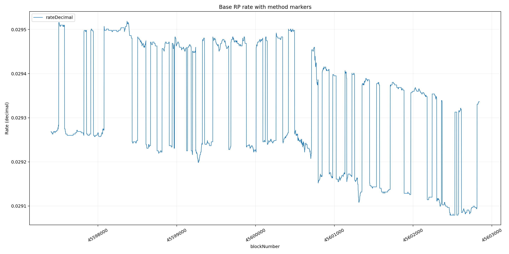

# Study 2

Wallet: `0x1d9d6e0169ae70e57beb44e4f1c18ffebd9773b9`  
Debank: https://debank.com/profile/0x1d9d6e0169ae70e57beb44e4f1c18ffebd9773b9

## Profit Study by Pool

### Mainnet - WBTC/WETH

- Wallet: https://etherscan.io/address/0x1d9d6e0169ae70e57beb44e4f1c18ffebd9773b9
- Pool: https://etherscan.io/address/0x114516921fb229a1bcae2bde26248ca7cf5644ed
- Balancer pool page: https://balancer.fi/pools/ethereum/v3/0x114516921fb229a1bcae2bde26248ca7cf5644ed
- RP: https://etherscan.io/address/0xdc34458ed74b578f60fe994770cf9693eee5a530

| Pool (short) | Adds | Removes | Capital in (USD) | Capital out (USD) | PnL (USD) | HODL at exit (USD) | LP - HODL (USD) | LP - HODL (%) |
| --- | ---: | ---: | ---: | ---: | ---: | ---: | ---: | ---: |
| `0x11451692…5644ed` | 1 | 1 | 69723.35 | 71272.6 | 1549.25 | 69896.29 | 1376.31 | 1.97 |

#### Event token prices

- ADD event `0x76571b0738f20554…` at ts `1777984943` (tx `0x76571b0738f205546f2184aac10dae35fc6fbdf5f6d4b8d959f2b08962ac57a2`)
  - token `0x2260fac5e5542a773aa44fbcfedf7c193bc2c599`: priceTimestamp=1777984943, matchedPricePointTimestamp=1777982400, amount=0.146053, priceUsdAtEvent=80557, usdContribution=11765.57
  - token `0xc02aaa39b223fe8d0a0e5c4f27ead9083c756cc2`: priceTimestamp=1777984943, matchedPricePointTimestamp=1777982400, amount=24.386643, priceUsdAtEvent=2376.62, usdContribution=57957.78
- REMOVE event `0x2698941e2cb0435e…` at ts `1777995107` (tx `0x2698941e2cb0435e3db493630d62eb4f22db36d31cc450ee8ea43d095b06e943`)
  - token `0x2260fac5e5542a773aa44fbcfedf7c193bc2c599`: priceTimestamp=1777995107, matchedPricePointTimestamp=1777993200, amount=0.44386, priceUsdAtEvent=81165, usdContribution=36025.93
  - token `0xc02aaa39b223fe8d0a0e5c4f27ead9083c756cc2`: priceTimestamp=1777995107, matchedPricePointTimestamp=1777993200, amount=14.809088, priceUsdAtEvent=2380.07, usdContribution=35246.67

---

### Base - WETH/cbBTC

- Wallet: https://basescan.org/address/0x1d9d6e0169ae70e57beb44e4f1c18ffebd9773b9
- Pool (scan): https://basescan.org/address/0x903460c1e2441b9df1d625fc6b4608d6d513ced8
- Balancer pool page: https://balancer.fi/pools/base/v3/0x903460c1e2441b9df1d625fc6b4608d6d513ced8
- RP: https://basescan.org/address/0x81225b69fdb536f4ff6d539892185de50e240749

| Pool (short) | Adds | Removes | Capital in (USD) | Capital out (USD) | PnL (USD) | HODL at exit (USD) | LP - HODL (USD) | LP - HODL (%) |
| --- | ---: | ---: | ---: | ---: | ---: | ---: | ---: | ---: |
| `0x903460c1…13ced8` | 1 | 1 | 20989.93 | 22115.11 | 1125.18 | 21062.29 | 1052.82 | 5 |

#### Event token prices

- ADD event `0x8cda446eeaf0e337…` at ts `1777984155` (tx `0x8cda446eeaf0e3374f9a8bf7e52d694d7f71c10be4c3f05d969896e0f3eccbb1`)
  - token `0x4200000000000000000000000000000000000006`: priceTimestamp=1777984155, matchedPricePointTimestamp=1777982400, amount=4.460373, priceUsdAtEvent=2376.62, usdContribution=10600.61
  - token `0xcbb7c0000ab88b473b1f5afd9ef808440eed33bf`: priceTimestamp=1777984155, matchedPricePointTimestamp=1777982400, amount=0.128333, priceUsdAtEvent=80956, usdContribution=10389.32
- REMOVE event `0xd924ec6cd8125791…` at ts `1777995031` (tx `0xd924ec6cd81257919b21947512f1ac4e734d0969921677c8f6ca4b4983ea015a`)
  - token `0x4200000000000000000000000000000000000006`: priceTimestamp=1777995031, matchedPricePointTimestamp=1777993200, amount=4.296477, priceUsdAtEvent=2380.93, usdContribution=10229.61
  - token `0xcbb7c0000ab88b473b1f5afd9ef808440eed33bf`: priceTimestamp=1777995031, matchedPricePointTimestamp=1777993200, amount=0.146067, priceUsdAtEvent=81370, usdContribution=11885.5

---

### Arbitrum - WETH/USDC

- Wallet: https://arbiscan.io/address/0x1d9d6e0169ae70e57beb44e4f1c18ffebd9773b9
- Pool (scan): https://arbiscan.io/address/0x59011e07bbcf95fad46154f8d83963dfe4242ad6
- Balancer pool page: https://balancer.fi/pools/arbitrum/v3/0x59011e07bbcf95fad46154f8d83963dfe4242ad6
- RP: https://arbiscan.io/address/0x4aff013cef34e2a02e854a31ff7ed2ad71a44a3e

| Pool (short) | Adds | Removes | Capital in (USD) | Capital out (USD) | PnL (USD) | HODL at exit (USD) | LP - HODL (USD) | LP - HODL (%) |
| --- | ---: | ---: | ---: | ---: | ---: | ---: | ---: | ---: |
| `0x59011e07…242ad6` | 1 | 1 | 8925.91 | 9023.91 | 98 | 8896.67 | 127.24 | 1.43 |

#### Event token prices

- ADD event `0xb6ba349214f48b0a…` at ts `1777993608` (tx `0xb6ba349214f48b0a3cdb78b050aa972d84d1232a74e67d26b2eddb8a8046bac1`)
  - token `0x82af49447d8a07e3bd95bd0d56f35241523fbab1`: priceTimestamp=1777993608, matchedPricePointTimestamp=1777993200, amount=2.010807, priceUsdAtEvent=2380.1, usdContribution=4785.92
  - token `0xaf88d065e77c8cc2239327c5edb3a432268e5831`: priceTimestamp=1777993608, matchedPricePointTimestamp=1777993200, amount=4140.723114, priceUsdAtEvent=0.999823, usdContribution=4139.99
- REMOVE event `0x4ba653d4dca5ff16…` at ts `1778001499` (tx `0x4ba653d4dca5ff16585a04a42d371e19cbfda33450400d1c1b662d6e3d8c874c`)
  - token `0x82af49447d8a07e3bd95bd0d56f35241523fbab1`: priceTimestamp=1778001499, matchedPricePointTimestamp=1778000400, amount=2.068985, priceUsdAtEvent=2365.59, usdContribution=4894.37
  - token `0xaf88d065e77c8cc2239327c5edb3a432268e5831`: priceTimestamp=1778001499, matchedPricePointTimestamp=1778000400, amount=4130.336117, priceUsdAtEvent=0.999807, usdContribution=4129.54

---

## Base RP method marker plot



This plot overlays the Base rate provider `getRate()` time series (sampled per block across the study window) with vertical markers for transactions that used method selector `0x11e17d9b`.

Interesting observation: there are no `0x11e17d9b` marker lines overlapping this sampled block range, even though the rate still changes stepwise throughout the window. This differs from the behavior observed in [`poolStudy1.md`](../poolStudy1/poolStudy1.md).

- Plot image: [`data/rpMethods/base_rate_with_0x11e17d9b_markers.png`](./data/rpMethods/base_rate_with_0x11e17d9b_markers.png)
- Plot script: [`data/rpMethods/plot_base_rate_with_method_markers.py`](./data/rpMethods/plot_base_rate_with_method_markers.py)
- Rate sampling script: [`data/rateCompare/sampleBaseRpByBlock.ts`](./data/rateCompare/sampleBaseRpByBlock.ts)
- Sampled rate data: [`data/rateCompare/baseRp_45597404_45602842.json`](./data/rateCompare/baseRp_45597404_45602842.json)
- Method-call source CSV (taken from Basescan): [`data/rpMethods/rateProviderTransactionList.csv`](./data/rpMethods/rateProviderTransactionList.csv)


## Base RP pre-range method-call trace analysis

We inspect this Tenderly trace to understand what the `0x11e17d9b` method call is doing on-chain and whether it reflects a configuration change relevant to the later pool activity.

Tenderly: https://www.tdly.co/tx/0x956c974f01e417c8473f67ec6e42323f965971257098510ac12a7cd1349513b8

- **Sender:** `0x1d9d6e0169ae70e57beb44e4f1c18ffebd9773b9`
- **Method selector:** `0x11e17d9b`

**Calldata**
```text
0x11e17d9b000000000000000000000000ba1333333333a1ba1108e8412f11850a5c319ba9000000000000000000000000903460c1e2441b9df1d625fc6b4608d6d513ced8
```

**Storage accesses**

- `SLOAD` (gas: `2,100`)
  - slot `0x00`
  - value `0x0000000000000000000000031d9d6e0169ae70e57beb44e4f1c18ffebd9773b9`

- `SLOAD` (gas: `2,100`)
  - slot `0x03`
  - value `0x0000000000000000000000ba1333333333a1ba1108e8412f11850a5c319ba902`

- `SSTORE` (gas: `100`)
  - slot `0x03`
  - old `0x0000000000000000000000ba1333333333a1ba1108e8412f11850a5c319ba902`
  - new `0x0000000000000000000000ba1333333333a1ba1108e8412f11850a5c319ba902` (no change)

- `SLOAD` (gas: `2,100`)
  - slot `0x05`
  - value `0x0000000000000000000000007354cc9a34e29827c3ff38e76a56387f9dbf242f`

- `SSTORE` (gas: `2,900`)
  - slot `0x05`
  - old `0x0000000000000000000000007354cc9a34e29827c3ff38e76a56387f9dbf242f`
  - new `0x000000000000000000000000903460c1e2441b9df1d625fc6b4608d6d513ced8`

- `SSTORE` (gas: `2,200`)
  - slot `0x04`
  - old `0x0000000000000000000000000000000000000000000000000000000000000000`
  - new `0x0000000000000000000000000000000000000000000000000000000000000000` (no change)

This trace shows a clear config change: slot `0x05` is updated to `0x903460c1e2441b9df1d625fc6b4608d6d513ced8` (the Base WETH/cbBTC pool). The transaction is at block `45597402`, which is before the EOA's add-liquidity transaction (`0x8cda446eeaf0e3374f9a8bf7e52d694d7f71c10be4c3f05d969896e0f3eccbb1`) in this pool.

## Inferred getRate calculation path (from trace)

Using Tenderly we can simulate the `getRate` call at block 45602103 to get the trace: https://www.tdly.co/shared/simulation/8b6f8810-3dc6-48d4-8ff0-c561e5fe5d41

- Top-level call to RP `0x81225b69fdb536f4ff6d539892185de50e240749` returns `29356849560000000`.
- CLPool: https://basescan.org/address/0x70acdf2ad0bf2402c957154f944c19ef4e1cbae1
- RP performs `CLPool.observe([3, 0])` and gets:
  - `tickCumulatives = [-13915197597314, -13915198394096]`
  - `secondsPerLiquidityCumulativeX128 = [226531416298343480998014208794421356988581494, 226531416298343480998017810086453026012750434]`
- RP then calls `Vault.getPoolTokenInfo(pool = 0x903460c1e2441b9df1d625fc6b4608d6d513ced8)` and receives:
  - tokens `[WETH, cbBTC]`
  - token config showing token0 uses this RP as its `rateProvider`
  - balance/scaled-balance style values used for normalization/context
- Final RP storage read includes slot `0x02 = 0x0e35fa931a0000 = 4_000_000_000_000_000` (0.004 in 1e18 fixed-point, i.e. 0.4%).

Numerical sanity checks:

- Over a 3 second window, `avgTick = (tickCumNow - tickCumPast) / 3 = -265594`, matching the CLPool internal trace.
- Converting this TWAP tick to a base price and adjusting decimals for WETH (18) vs cbBTC (8) gives an inferred base rate near `2.9239896359566455e16` (1e18-scaled).
- Observed return is `2.935684956e16`, which is very close to applying a +0.4% factor:
  - `returned / base ~= 1.00399978`.

Working inference:

`getRate` is likely computed as:

1. derive oracle price from short-horizon CLPool TWAP (`observe([3,0])`);
2. normalize by token decimals/direction (WETH/cbBTC ordering from Vault data);
3. apply a configurable 0.4% adjustment/bound from RP storage (slot `0x02`);
4. return 1e18-scaled rate (`29356849560000000` in this simulation).

Confidence: high on the observed components and numeric relationship; medium on exact branching details without verified Solidity source for this RP.

Interpretation of observed jumps in sampled `getRate()` series:

The step-like jumps observed across the sampled block range may be produced by state-dependent `getRate` logic that incorporates `Vault.getPoolTokenInfo(...)` outputs (token config plus live/scaled balance context), rather than requiring in-range manual RP method calls for each transition. This fits the trace path (`observe([3,0])` + `getPoolTokenInfo(...)` + config read from slot `0x02`) and the absence of overlapping `0x11e17d9b` markers in the sampled window. At this stage, this remains an inference (not a source-verified proof of exact branch conditions).


